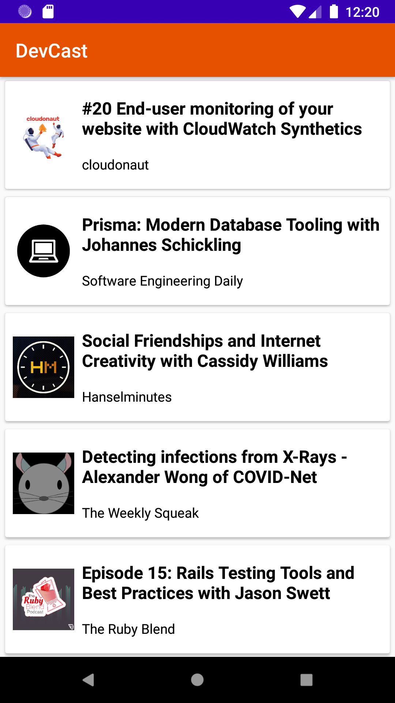
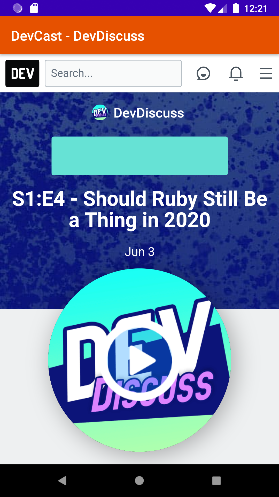

# DevCast

## Android App for Developer podcasts #30DaysOfKotlin

DevCast (short term for Developer Podcasts) is a podcasts app which uses official API from [Dev.to](https://dev.to)

  
  

Created this app to learn Kotlin and Android Native developement, as well as project submission for #30DaysOfKotlin which was conducted by Google India. Learnt a ton by comparing Kotlin with Swift and Android Native with iOS native.

## Links

### Google Codelabs

- [Kotlin Bootcamp for beginners](https://developer.android.com/courses/kotlin-bootcamp/overview?utm_source=week1&utm_medium=email&utm_campaign=30DaysOfKotlin&utm_term=Basic)
- [Android Kotlin Fundamentals](https://developer.android.com/courses/kotlin-android-fundamentals/overview?utm_source=week1&utm_medium=email&utm_campaign=30DaysOfKotlin&utm_term=Intermediate)
- [Advanced Android in Kotlin](https://developer.android.com/courses/kotlin-android-advanced/overview?utm_source=week1&utm_medium=email&utm_campaign=30DaysOfKotlin&utm_term=Advanced)
- [All Kotlin resources from Google Codelabs](https://eventsonair.withgoogle.com/events/kotlin/resources)

### Others

- [Andriod Bootcamp by Raywenderlich](https://www.raywenderlich.com/10529094-android-bootcamp)
- [Andriod Crash Course for iOS developers](https://www.youtube.com/watch?v=gDEGd174K_Q&list=WL&index=42&t=0s)
